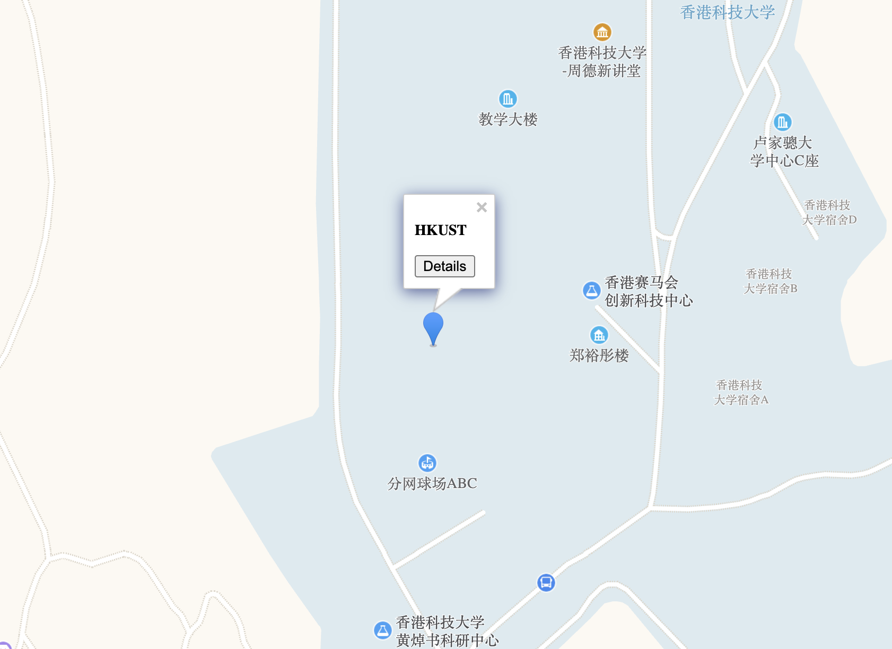

# LMap: A Map Marker Tool based on Amap

## Installation

```
pip install git+https://github.com/enhuiz/LMap
```

## Example

```python
from lmap import LMap

lmap = LMap("My Markers")
lmap.add_marker(
    name="HKUST",
    long=114.268,
    lat=22.332,
    content="<button onclick=\"location.href='https://www.ust.hk/home'\">Details</button>",
)
lmap.render("index.html")
```

Open the index.html, you will get:



## Credits

1. https://blog.csdn.net/Bameirilyo/article/details/83864222
2. https://lbs.amap.com/api/javascript-api/summary/
